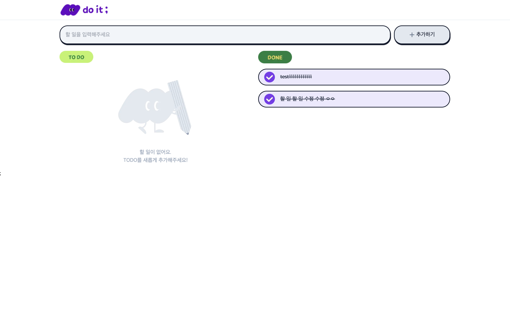
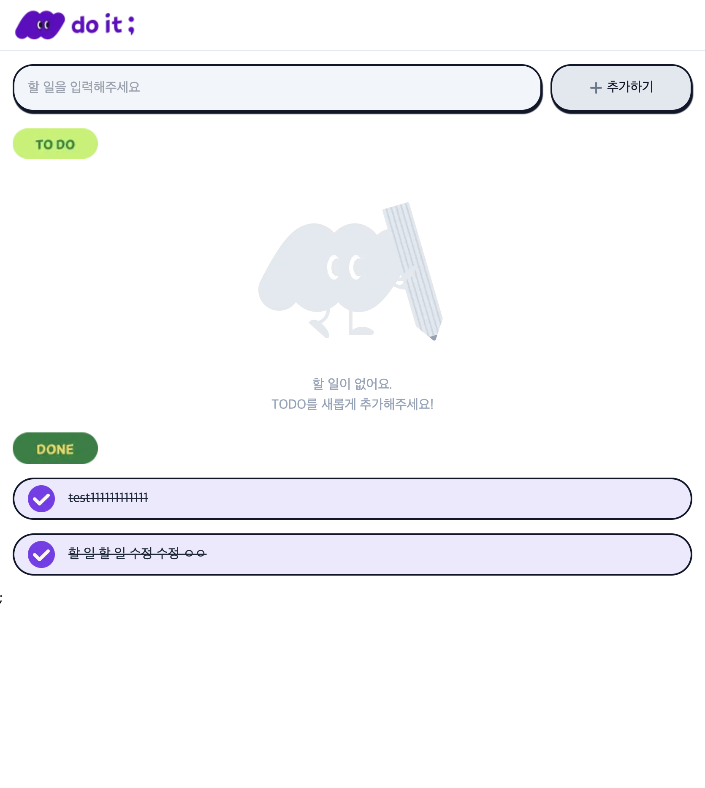
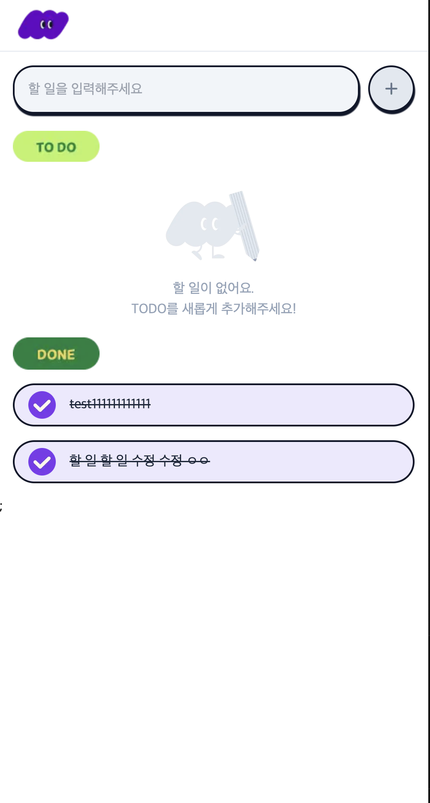
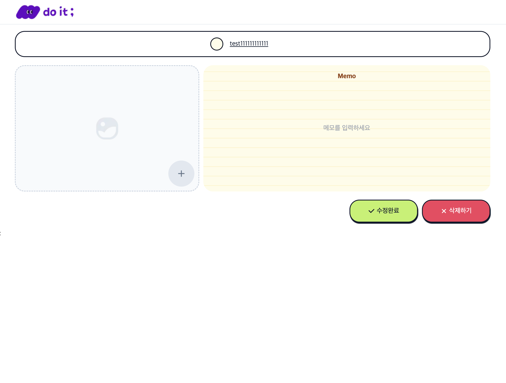
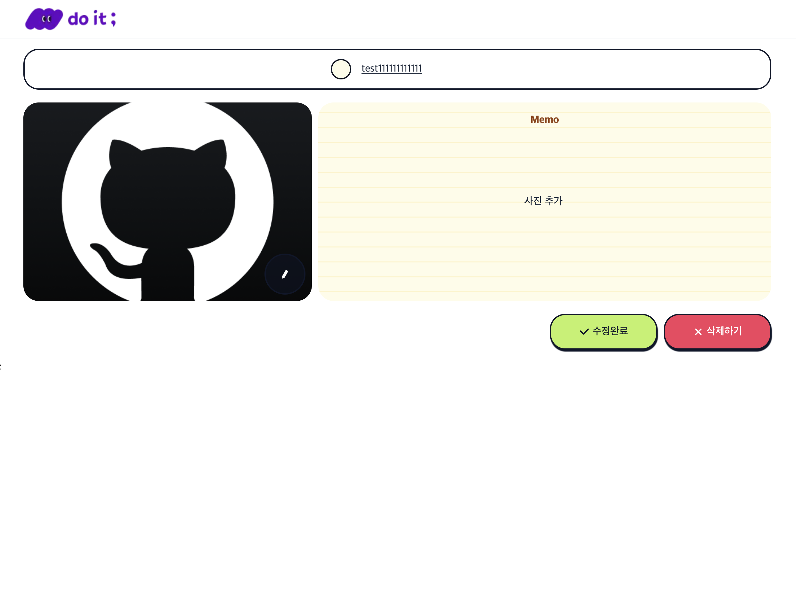
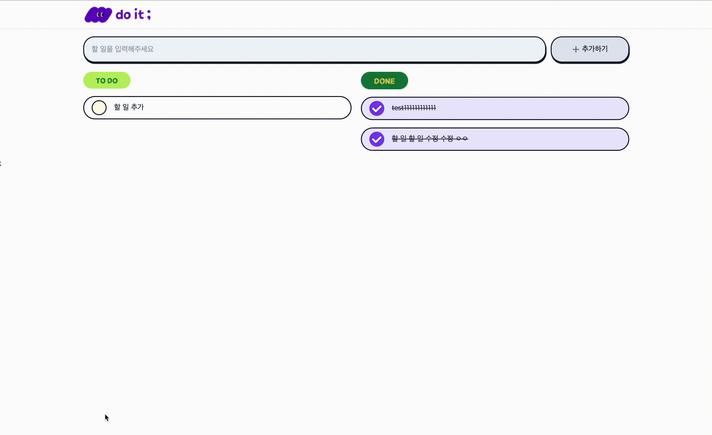

# Todo List

## 📝 프로젝트 설명

Next.js와 TypeScript로 TodoListAPI를 활용하여 만든 Todo List. 

사용자는 할 일을 추가하고, 사진과 메모를 작성하며, 할 일을 수정하고 삭제할 수 있습니다. 

각 Todo의 완료 및 미완료 상태를 관리할 수 있습니다.

## 🍃 배포 주소

### https://todo-list-fawn-delta.vercel.app/

## 🚀 주요 기능

- Todo 항목 생성, 수정, 삭제
- 각 Todo에 대한 메모 작성
- 이미지 업로드 기능
- 완료 상태 토글 기능
- 반응형 디자인

## ⚒️ 기술 스택 
- Next.js
- TypeScript
- Axios

## 🧐 사용 방법

### 패키지 설치 

```
    npm install
```
### 실행
```
    npm run dev
```

## 사이트 구성

### 📌 메인 페이지 ('/')

### 웹 


### 테블릿 



### 모바일 



### 📌 상세 페이지 ([/itemID])


### 사진 메모 추가 전 




### 사진 메모 추가 후



## 🎥 시연

메인 페이지에서 할 일 추가 후 상세페이지에서 메모만 추가하여 수정하기 누르면 / 으로 돌아갑니다



할 일 이름 수정, 사진 추가, 메모 수정 
상세 페이지에서도 할 일 완료 상태 변경 가능  
삭제하기까지 

삭제 후, 수정 후 모두 메인으로 리다이렉트

